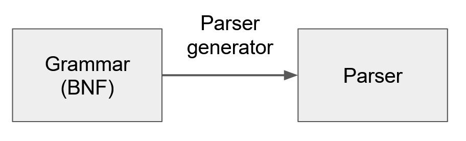
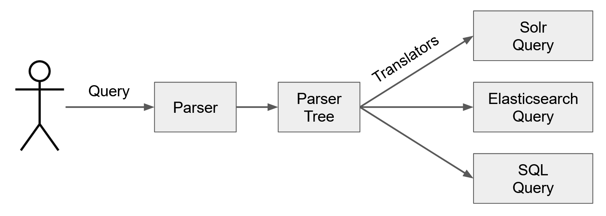

# Custom Query Languages in PDS API Server

## Study Goals
The goal of this study was to evaluate few parser generators such as JavaCC and ANTLR
to support custom query languages in PDS API Server.

## PDS API Server
PDS API Server is a lightweight Web application that allows users to search
PDS product metadata stored in PDS Registry.
The API server is written in Java and is based on Spring Boot framework.
PDS metadata is stored in Apache Solr server.

### Form-Based Query API
Current implementation of API server uses HTTP query parameters to specify search criteria.
For example,
```html
http://<host>/<api_url>?mission=LRO&instrument=LROC
```
API server parses HTTP parameters and creates corresponding Solr query:
```html
mission:LRO AND instrument:LROC
```
The form-based API is very simple, but has limited support for logical expressions and other 
advanced Solr query language features. Also it is tightly coupled with HTTP protocol.

## Parser Generators
A parser generator, sometimes also called a "compiler compiler", is an application which generates a parser.
It takes a grammar as input and automatically generates source code
that can parse a stream of characters using the grammar.
A grammar is usually defined in Backus-Naur Form (BNF) notation. 



In addition to an autogenerated parser, one or more translators are required to convert custom query
into a language that search back-ends understand.




## JavaCC and ANTLR
There are multiple open source parser generators for different programming languages.
The most popular Java implementations are JavaCC and ANTLR.


## ANTLR Example

In this example we will define a simple grammar which can handle queries like this:
```java
mission = "LRO" AND (instrument = "LROC" OR instrument = "LAMP")
```

### Grammar Definition

Create a file called "Hello.g4":

```
grammar Hello;

query : expression EOF ; 
expression : queryTerm ((AND | OR) queryTerm)* ;
queryTerm : FIELD EQ STRINGVAL | LPAREN expression RPAREN ;

EQ : '=' ;

LPAREN : '(' ;
RPAREN : ')' ;

AND : 'AND' | 'and' ;
OR  : 'OR' | 'or' ;

FIELD     : [A-Za-z_] [A-Za-z0-9_.]* ;
STRINGVAL : '"' ~ ["\r\n]* '"' ;

WS : [ \t\r\n]+ -> skip ;
```

### Generating the Parser

Run the following command to generate the parser from Hello.g4 grammar.

```
java -jar antlr-4.8-complete.jar -package t2 Hello.g4
```

### Testing the Parser

```java
package tt;

import org.antlr.v4.runtime.CharStreams;
import org.antlr.v4.runtime.CodePointCharStream;
import org.antlr.v4.runtime.CommonTokenStream;
import org.antlr.v4.runtime.tree.ParseTree;

import t2.HelloLexer;
import t2.HelloParser;

public class TestAntlr1
{
    public static void main(String[] args)
    {
        CodePointCharStream input = CharStreams.fromString("flag = \"1\" and (test = \"a1\" or test = \"a2\") ");
        HelloLexer lex = new HelloLexer(input);
        CommonTokenStream tokens = new CommonTokenStream(lex);

        HelloParser par = new HelloParser(tokens);
        ParseTree tree = par.query();
        
        System.out.println(tree.toStringTree(par));
    }
}

```

## Summary

